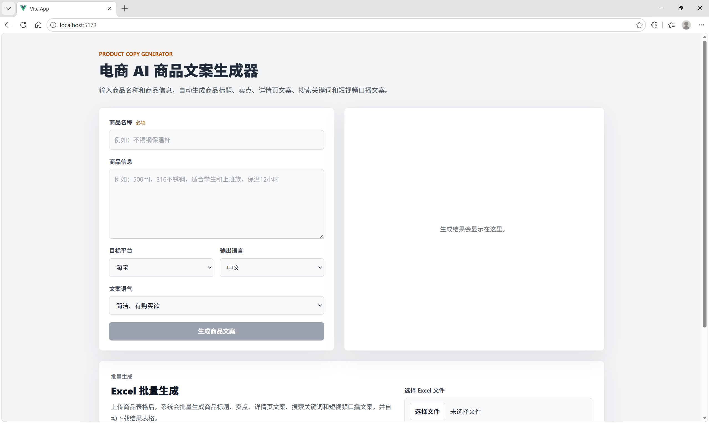
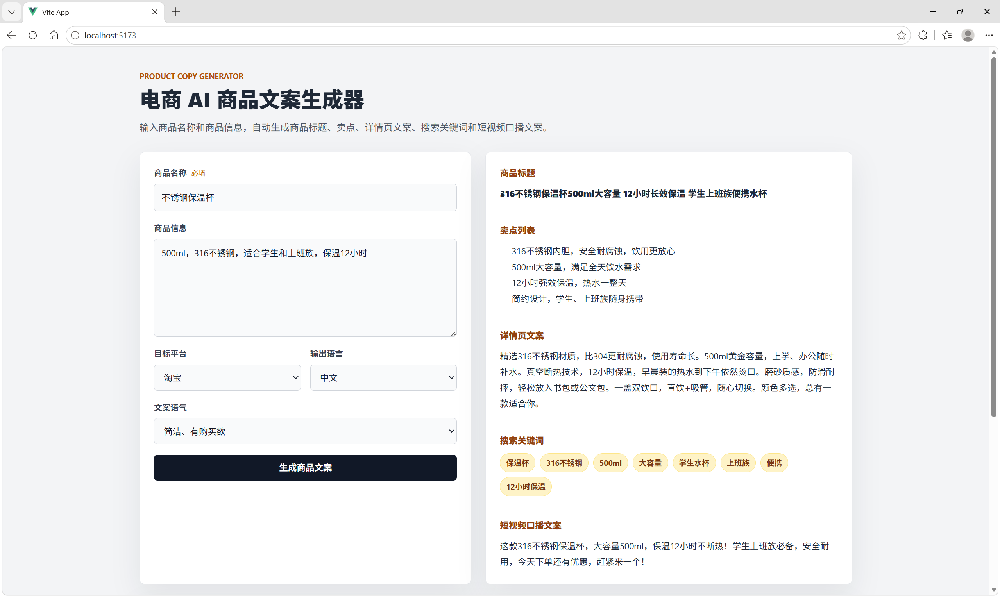
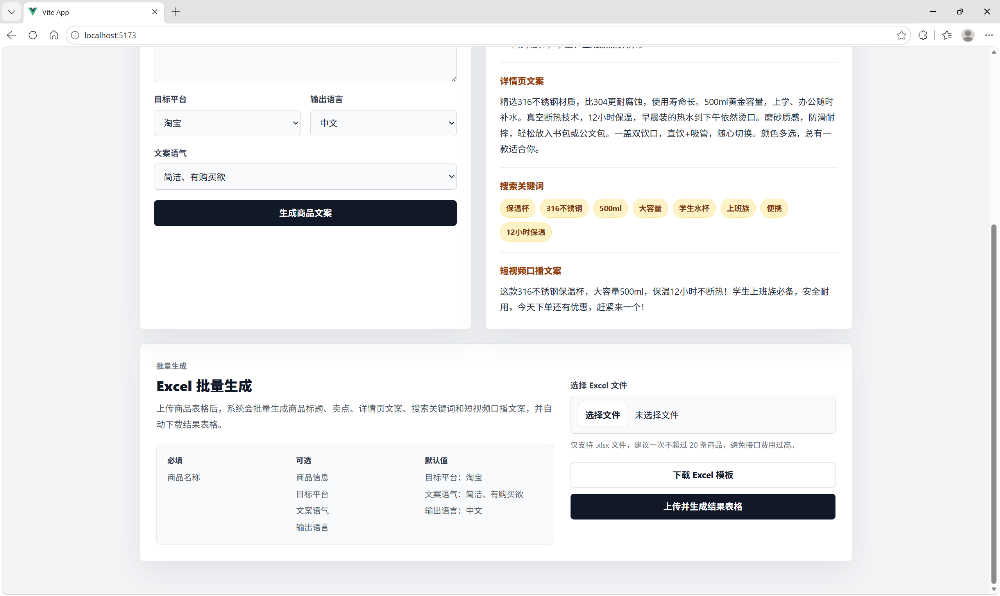
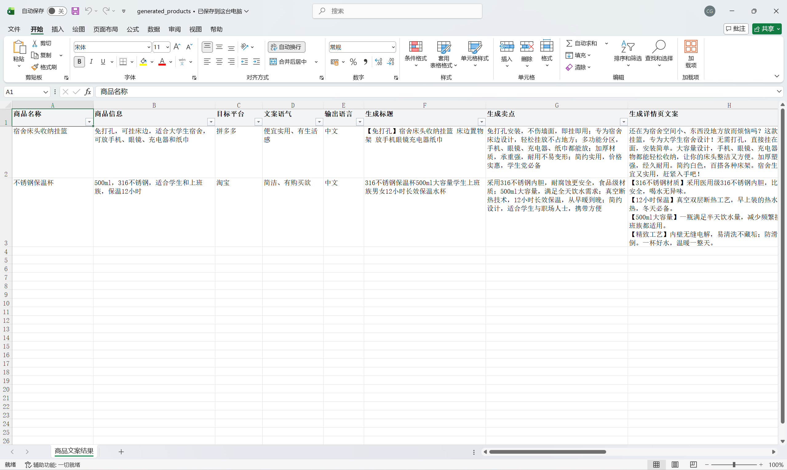

# AI 电商商品文案生成器

这是一个面向电商运营、小商家和内容创作者的 AI 商品文案生成工具。

项目基于开源项目 `product-info-ai-generator` 进行二次开发。原项目主要支持从商品图片生成商品信息。本项目在此基础上扩展为更适合中文电商场景的工具，支持单商品文案生成、Excel 批量生成、Excel 模板下载、平台风格适配和文案语气预设。

## 项目定位

很多小商家在上架商品时，需要反复编写：

- 商品标题
- 商品卖点
- 商品详情页文案
- 搜索关键词
- 短视频口播文案

如果商品数量较多，手动写文案效率很低。本项目希望通过 AI 帮助商家快速生成适合不同平台的商品文案，提高商品上架和内容生产效率。

## 功能特点

### 1. 单商品文案生成

用户输入商品名称、商品信息、目标平台、文案语气和输出语言后，系统会生成：

- 商品标题
- 卖点列表
- 详情页文案
- 搜索关键词
- 短视频口播文案

适合快速生成单个商品的标题、详情页初稿和短视频口播内容。

### 2. 支持不同电商平台风格

目前支持以下平台预设：

- 淘宝
- 拼多多
- 京东
- 抖音电商
- 小红书
- 闲鱼
- 1688
- 自定义平台

不同平台会注入不同的文案规则。例如：

- 淘宝：偏搜索关键词和转化
- 拼多多：偏实用、直接、性价比
- 京东：偏品质、参数和可靠感
- 小红书：偏种草、生活方式和体验感
- 抖音电商：偏短视频口播和转化节奏
- 闲鱼：偏真实自然，避免过度广告化
- 1688：偏批发、源头、采购和商用价值

### 3. 支持文案语气预设

目前支持以下文案语气：

- 简洁、有购买欲
- 便宜实用、有生活感
- 专业参数型
- 小红书种草型
- 直播口播型
- 高端质感型
- 真实自然型
- 年轻人网感型
- 自定义语气

用户可以直接选择预设语气，也可以填写自己的文案风格要求。

### 4. Excel 批量生成

用户可以上传包含商品信息的 `.xlsx` 文件，系统会批量生成商品文案，并自动下载结果表格。

适合以下场景：

- 批量上架商品
- 批量生成商品标题
- 批量生成详情页文案
- 批量生成短视频口播文案
- 给客户快速制作商品文案初稿

### 5. Excel 模板下载

系统提供标准 Excel 模板下载功能。

模板中包含：

- 中文表头
- 示例商品
- 平台下拉选择
- 文案语气下拉选择
- 输出语言下拉选择

用户下载模板后，只需要填写商品信息，再上传即可生成结果。

### 6. Excel 结果表格优化

生成后的 Excel 表格已经做了基础排版优化：

- 中文表头
- 首行冻结
- 自动筛选
- 合理列宽
- 长文本自动换行
- 处理状态显示“成功 / 失败”
- 错误信息单独展示

## 技术栈

### 前端

- Vue 3
- Vite
- TypeScript
- CSS

### 后端

- Python
- Flask
- OpenAI SDK
- DeepSeek OpenAI-compatible API
- openpyxl
- python-dotenv

### AI 能力

- DeepSeek API 文本生成
- Prompt 平台规则注入
- Prompt 文案语气规则注入
- JSON 结构化输出

## 项目结构

```text
product-info-ai-generator
├── backend
│   ├── app.py                 # Flask 后端入口
│   ├── deepseek_text.py        # DeepSeek 文案生成逻辑
│   ├── copy_presets.py         # 平台规则和语气规则
│   ├── excel_service.py        # Excel 模板和批量生成逻辑
│   ├── image.py                # 原项目图片处理逻辑
│   ├── Product.py              # 原项目商品结构
│   └── requirements.txt        # 后端依赖
│
├── frontend
│   ├── src
│   │   ├── views
│   │   │   └── HomeView.vue    # 主页面
│   │   ├── composables
│   │   │   ├── useGenerate.ts
│   │   │   ├── useExcelGenerate.ts
│   │   │   └── useExcelTemplate.ts
│   │   └── constants
│   │       └── copyOptions.ts  # 前端平台和语气选项
│   └── package.json
│
├── package.json
├── README.md
└── .gitignore
```

## 环境准备

### 1. 克隆项目

```bash
git clone https://github.com/kaputsg/ai-product-copy-generator.git
cd ai-product-copy-generator
```

### 2. 配置后端环境变量

在 `backend` 目录下创建 `.env` 文件：

```env
DEEPSEEK_API_KEY=你的 DeepSeek API Key
DEEPSEEK_BASE_URL=https://api.deepseek.com
DEEPSEEK_MODEL=deepseek-v4-flash
MAX_EXCEL_ROWS=20
```

说明：

- `DEEPSEEK_API_KEY`：DeepSeek API Key
- `DEEPSEEK_BASE_URL`：DeepSeek API 地址
- `DEEPSEEK_MODEL`：使用的模型名称
- `MAX_EXCEL_ROWS`：单次 Excel 最多处理行数，默认建议 20，避免 API 费用过高

注意：`.env` 文件不要提交到 GitHub。

## 后端启动

进入后端目录：

```bash
cd backend
```

创建虚拟环境：

```bash
python -m venv .venv
```

Windows 激活虚拟环境：

```bash
.\.venv\Scripts\Activate.ps1
```

安装依赖：

```bash
pip install -r requirements.txt
```

启动 Flask 后端：

```bash
python -m flask --app app run --host 127.0.0.1 --port 5000
```

后端默认运行在：

```text
http://127.0.0.1:5000
```

## 前端启动

新开一个终端，进入前端目录：

```bash
cd frontend
```

安装依赖：

```bash
npm install
```

启动前端：

```bash
npm run dev
```

前端默认运行在：

```text
http://localhost:5173
```

## 使用方式

### 单商品生成

1. 打开前端页面
2. 输入商品名称
3. 填写商品信息
4. 选择目标平台
5. 选择文案语气
6. 选择输出语言
7. 点击生成商品文案
8. 查看生成结果

### Excel 批量生成

1. 点击“下载 Excel 模板”
2. 按模板填写商品信息
3. 上传 `.xlsx` 文件
4. 点击“上传并生成结果表格”
5. 系统自动下载生成后的 Excel 文件

## Excel 模板字段说明

| 字段 | 是否必填 | 说明 |
|---|---|---|
| 商品名称 | 必填 | 商品的基础名称 |
| 商品信息 | 可选 | 商品规格、材质、适用人群、使用场景等 |
| 目标平台 | 可选 | 支持淘宝、拼多多、京东、抖音电商、小红书、闲鱼、1688、自定义 |
| 文案语气 | 可选 | 支持多种预设语气，也可以自定义 |
| 输出语言 | 可选 | 默认中文，也支持英文 |

模板示例：

| 商品名称 | 商品信息 | 目标平台 | 文案语气 | 输出语言 |
|---|---|---|---|---|
| 宿舍床头收纳挂篮 | 免打孔，可挂床边，适合大学生宿舍，可放手机、眼镜、充电器和纸巾 | 拼多多 | 便宜实用、有生活感 | 中文 |
| 不锈钢保温杯 | 500ml，316不锈钢，适合学生和上班族，保温12小时 | 淘宝 | 简洁、有购买欲 | 中文 |

## 平台预设说明

| 平台 | 文案方向 |
|---|---|
| 淘宝 | 偏搜索关键词和购买转化，适合标题和详情页 |
| 拼多多 | 偏实用、直接、性价比，突出日常使用场景 |
| 京东 | 偏品质、参数、可靠感，突出材质和服务信任 |
| 抖音电商 | 偏短视频口播和快速转化，语言更直接 |
| 小红书 | 偏种草、生活方式、体验感和分享感 |
| 闲鱼 | 偏真实自然，适合二手转让或个人推荐 |
| 1688 | 偏批发、源头、采购和商用价值 |
| 自定义 | 用户可以输入自己的平台要求 |

## 文案语气说明

| 语气 | 适合场景 |
|---|---|
| 简洁、有购买欲 | 大多数普通商品，适合快速生成转化文案 |
| 便宜实用、有生活感 | 宿舍用品、日用品、小家居、小百货 |
| 专业参数型 | 数码、家电、工具、设备类商品 |
| 小红书种草型 | 美妆、服饰、家居、生活方式类商品 |
| 直播口播型 | 短视频带货、直播间讲品 |
| 高端质感型 | 礼品、高客单价商品、设计感商品 |
| 真实自然型 | 闲鱼、二手商品、个人推荐 |
| 年轻人网感型 | 面向年轻用户的轻松风格商品 |
| 自定义 | 用户可以输入自己的语气要求 |

## API 接口说明

### 1. 单商品文案生成

```http
POST /api/generate-text
```

请求示例：

```json
{
  "product_name": "不锈钢保温杯",
  "product_info": "500ml，316不锈钢，适合学生和上班族，保温12小时",
  "target_platform": "淘宝",
  "tone": "简洁、有购买欲",
  "language": "中文"
}
```

返回示例：

```json
{
  "result": {
    "title": "316不锈钢保温杯500ml大容量男女学生上班族水杯",
    "selling_points": [
      "316不锈钢内胆，耐腐蚀更安全",
      "500ml容量，满足日常饮水需求"
    ],
    "description": "这款保温杯适合学生和上班族日常使用，采用316不锈钢内胆，保温时间长，适合通勤、上课和办公室使用。",
    "keywords": [
      "保温杯",
      "316不锈钢",
      "学生水杯",
      "上班族水杯"
    ],
    "short_video_script": "500ml大容量，316不锈钢内胆，学生上课和上班通勤都适合。热水冷水都能装，日常带出门很方便。"
  }
}
```

### 2. Excel 批量生成

```http
POST /api/generate-excel
```

请求方式：上传 `.xlsx` 文件。

返回：生成后的 Excel 文件。

### 3. Excel 模板下载

```http
GET /api/excel-template
```

返回：`product_template.xlsx`

### 4. 原图片生成接口

```http
POST /api/generate
```

说明：这是原项目保留的图片商品信息生成接口。

## 当前已完成功能

- 单商品 AI 文案生成
- Excel 批量文案生成
- Excel 模板下载
- 中文化前端页面
- 中文化 Excel 输出
- 平台风格预设
- 文案语气预设
- 平台和语气支持自定义
- Excel 模板下拉选择
- Excel 输出排版优化
- DeepSeek API 接入
- JSON 结构化输出

## 项目截图

### 单商品生成页面



### 单商品生成结果



### Excel 批量生成与模板下载



### Excel 批量生成结果



## 后续可优化方向

- 增加广告法敏感词检测
- 增加平台违禁词提示
- 增加商品类目自动识别
- 增加生成结果二次改写
- 增加文案评分功能
- 增加历史记录保存
- 增加用户登录和项目管理
- 增加商家工作台
- 支持更多平台文案规则
- 支持多语言电商文案
- 部署到云服务器
- 接入真实电商平台 API

## 注意事项

1. 当前项目仍是 MVP 阶段，适合学习、演示和小范围验证。
2. 生成内容需要人工复核，不能直接保证完全符合平台审核规则。
3. 不同平台可能有广告法、违禁词、类目规则等限制，正式商用前需要增加审核机制。
4. Excel 批量生成会消耗 API 额度，建议限制单次处理数量。
5. `.env` 文件包含 API Key，不要提交到 GitHub。

## 项目说明

本项目是基于开源项目的二次开发练习项目，主要用于学习 AI 应用开发、前后端接口对接、DeepSeek API 调用、Excel 批量处理和电商文案生成流程。

当前项目适合作为作品集展示、AI 应用开发练习和小商家场景验证，不建议直接作为生产级系统使用。